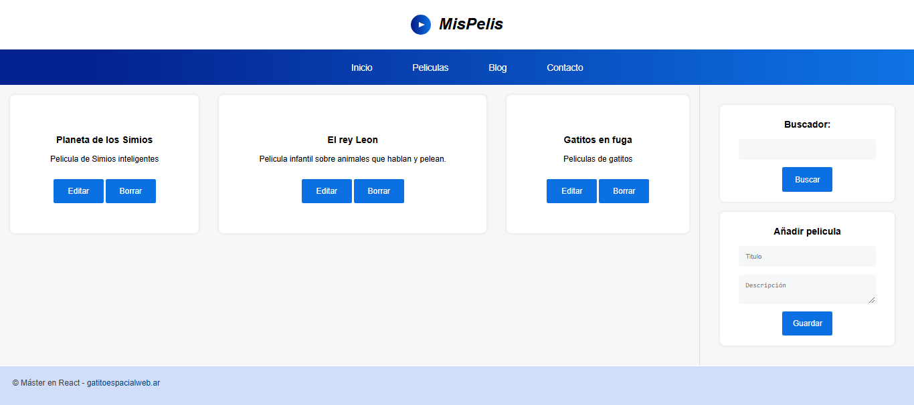
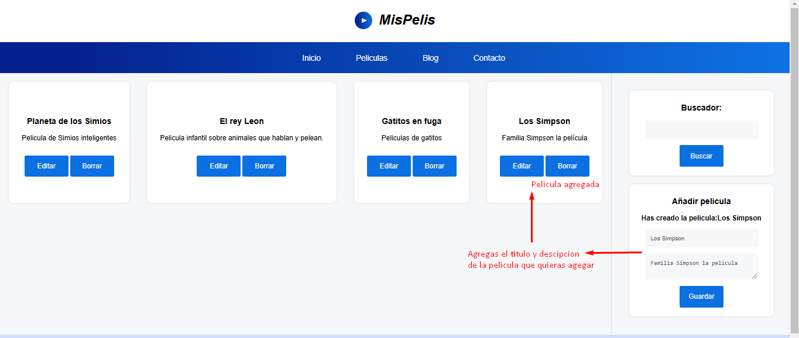
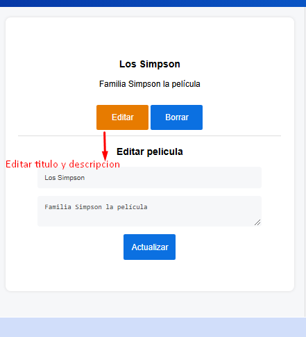
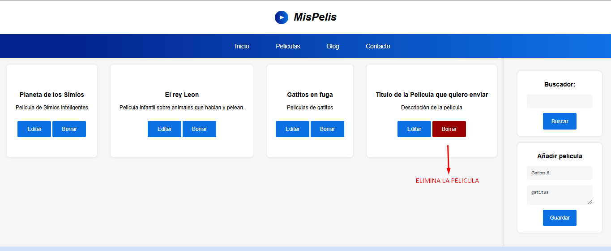

# Pagina web de Peliculas 🎥

Pagina estatica enfocada en mostrar el titulo y descripcion de las peliculas que quieras.
No utilice ninguna base de datos, la informacion se almacena en el localStorage del navegador.

## Tabla de Contenidos

- [Características](#caracteristicas)
- [Diseño y estructura](#diseño)
- [Tecnologías](#tecnologias)
- [Instalación](#instalacion)
- [Interfaz](#interfaz)
- [Despliegue](#despliegue)
- [Contacto](#contacto)

## Características 💬 <a id="caracteristicas"></a>

- Buscador de películas: Permite buscar las películas añadidas a tu lista.
- Añadir películas: Opción para agregar nuevas películas ingresando un título y una descripción.
- Eliminar películas: Permite eliminar cualquier película de la lista.
- Editar películas: Posibilita modificar el título y la descripción de las películas registradas.

## Diseño y estructura del proyecto 🎨 <a id="diseño"></a>

- **HTML5**: Para la estructura del contenido.
- **CSS3**: Para la estilización y personalización de la interfaz.
- **Flexbox**: Para la distribución y alineación flexible de los elementos.
- **CSS Grid Layout**: Para la organización avanzada de la disposición en cuadrícula.

## Tecnologías 🌐 <a id="tecnologias"></a>

- **React**: Biblioteca principal para la construcción de la interfaz de usuario.
- **ReactDOM**: Renderiza los componentes de React en el DOM.
- **useState**: Hook para manejar el estado local de los componentes.
- **useEffect**: Hook para gestionar efectos secundarios, como llamadas a APIs o sincronización con el DOM.

Antes de instalar, descargue e instale Node.js.☑️

1. Clona el repositorio:

```bash
  git clone https://github.com/freya-godoy/Red-Social-Backend.git
```

2. Instala dependencias del proyecto:

```sh
npm install
```

## Interfaz 💻 <a id="interfaz"></a>

Inicio 💻



Agregar pelicula 🎬



Editar pelicula 📝



Eliminar pelicula 🚮



## Despliegue 📂 <a id="despliegue"></a>

Despliegue desde la consola:

```sh
npm start
```

## Contribuciones 👇

¡Las contribuciones son bienvenidas! Sigue estos pasos:

1. Haz un fork del repositorio.
2. Crea una rama nueva: `git checkout -b nueva-rama`.
3. Realiza tus cambios y haz un commit: `git commit -m "Descripción"`.
4. Sube los cambios: `git push origin nueva-rama`.
5. Abre un Pull Request.

## Contacto 📬 <a id="contacto"></a>

- Email: freya.godoy.20@hotmail.com
